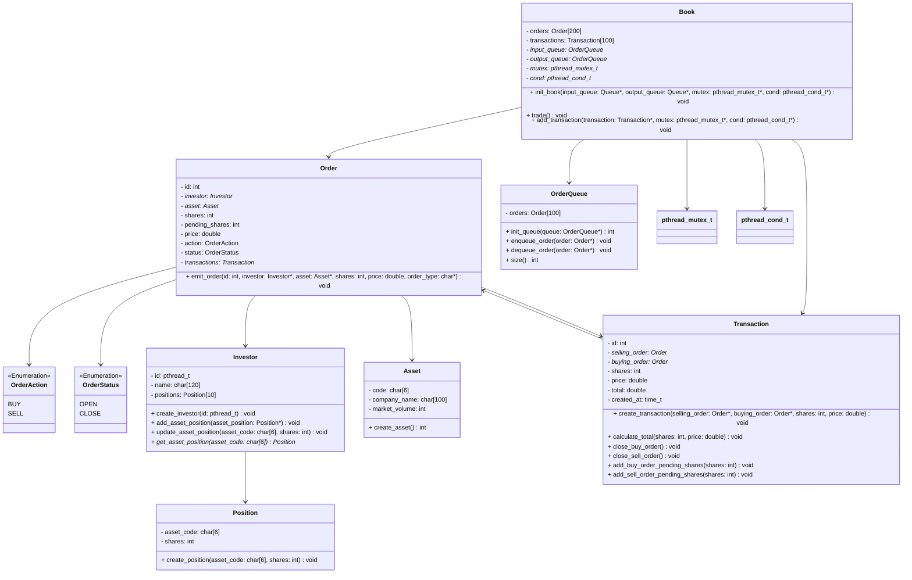

# Documentação

> **Integrantes:**
> 
> Enzo Ribeiro                    - 10418262  
> Gabriel Ken Kazama Geronazzo    - 10418247  
> Lucas Pires de Camargo Sarai    - 10418013  
> Lucas Zanini da Silva           - 10417361

# Entidades

## Entidade: `Investor`

### Descrição

A entidade `Investor` representa um investidor que possui uma carteira de ativos financeiros. Eles realizam ações de compra e venda de ações de forma aleatória, com intervalos variáveis e revezamento em grupos, onde a aplicação pode seguir o conceito de escalonamento circular por quantum, semelhante ao Round Robin. Além disso, a lógica de multithreading será usada para simular a execução de cada investidor, e uma fila de execução será usada para gerenciar os grupos de investidores ativos.

### Atributos

- **id**: `pthread_t` - Referência da thread responsável por simular as ações do investidor. 
- **name**: `char[120]` - Nome do investidor. Deve ter menos de 120 caracteres.
- **positions**: `Position[10]` - Array que armazena até 10 posições de ativos. Cada posição representa uma quantidade de ações de um ativo específico.

### Métodos

- **`create_investor(id: pthread_t)`**: Inicializa o investidor com um identificador de thread e nome. Define o nome e inicializa as posições com valores padrão.
- **`add_asset_position(asset_position: Position*)`**: Adiciona uma nova posição de ativo à carteira do investidor. Se já houver 10 posições, a operação falhará.
- **`update_asset_position(asset_code: char[6], shares: int)`**: Atualiza a quantidade de ações de um ativo específico na carteira do investidor.
- **`get_asset_position(asset_code: char[6])`**: Recupera a posição do ativo correspondente ao código fornecido.

### Regras de Negócio

- O nome do investidor deve ser não-nulo e menor que 120 caracteres.
- O código do ativo deve ter exatamente 6 caracteres.
- A quantidade de ações não pode ser negativa.

---

## Entidade: `Position`

### Descrição

A entidade `Position` representa a quantidade de ações que um investidor possui em um ativo específico.

### Atributos

- **asset_code**: `char[6]` - Código do ativo. Deve ter exatamente 6 caracteres.
- **shares**: `int` - Quantidade de ações que o investidor possui para o ativo especificado.

### Métodos

- **`create_position(asset_code: char[6], shares: int)`**: Inicializa uma posição com um código de ativo e uma quantidade de ações.

### Regras de Negócio

- O código do ativo deve ter exatamente 6 caracteres.
- A quantidade de ações não pode ser negativa.

---

## Entidade: `Asset`

### Descrição

A entidade `Asset` representa um ativo financeiro disponível no mercado, como uma ação de uma empresa.

### Atributos

- **code**: `char[6]` - Código do ativo. Deve ter exatamente 6 caracteres.
- **company_name**: `char[100]` - Nome da empresa que emitiu o ativo. Deve ter menos de 100 caracteres.
- **market_volume**: `int` - Volume de mercado do ativo, indicando a quantidade total disponível no mercado.

### Métodos

- **`create_asset()`**: Inicializa um novo ativo com código, nome da empresa e volume de mercado.

### Regras de Negócio

- O código do ativo deve ter exatamente 6 caracteres.
- O nome da empresa deve ser não-nulo e menor que 100 caracteres.
- O volume de mercado deve ser um valor não-negativo.

---

## Entidade: `Order`

### Descrição

A entidade `Order` representa uma ordem de compra ou venda de ações de um ativo.

### Atributos

- **id**: `int` - Identificador único da ordem.
- **investor**: `Investor*` - Investidor que emitiu a ordem.
- **asset**: `Asset*` - Ativo envolvido na ordem.
- **shares**: `int` - Quantidade de ações envolvidas na ordem.
- **pending_shares**: `int` - Quantidade de ações pendentes para completar a ordem.
- **price**: `double` - Preço por ação na ordem.
- **order_type**: `OrderType` - Tipo da ordem (compra ou venda).
- **status**: `OrderStatus` - Status da ordem (aberta ou fechada).
- **transactions**: `Transaction*` - Transações associadas a esta ordem.

### Métodos

- **`emit_order(id: int, investor: Investor*, asset: Asset*, shares: int, price: double, order_type: char*)`**: Emite uma nova ordem com os detalhes fornecidos.

### Regras de Negócio

- A quantidade de ações deve ser positiva.
- O preço deve ser um valor positivo.
- O tipo da ordem deve ser válido (compra ou venda).

---

## Entidade: `Transaction`

### Descrição

A entidade `Transaction` representa a conclusão de uma ordem de compra e venda de ações.

### Atributos

- **id**: `int` - Identificador único da transação.
- **selling_order**: `Order*` - Ordem de venda associada à transação.
- **buying_order**: `Order*` - Ordem de compra associada à transação.
- **shares**: `int` - Quantidade de ações transacionadas.
- **price**: `double` - Preço por ação na transação.
- **total**: `double` - Valor total da transação.
- **created_at**: `time_t` - Data e hora em que a transação foi criada.

### Métodos

- **`create_transaction(selling_order: Order*, buying_order: Order*, shares: int, price: double)`**: Cria uma nova transação com os detalhes fornecidos.
- **`calculate_total(shares: int, price: double)`**: Calcula o valor total da transação.
- **`close_buy_order()`**: Marca a ordem de compra como fechada.
- **`close_sell_order()`**: Marca a ordem de venda como fechada.
- **`add_buy_order_pending_shares(shares: int)`**: Adiciona ações pendentes à ordem de compra.
- **`add_sell_order_pending_shares(shares: int)`**: Adiciona ações pendentes à ordem de venda.

### Regras de Negócio

- A quantidade de ações e o preço devem ser positivos.
- As ordens associadas devem estar corretamente relacionadas à transação.

---

## Entidade: `OrderQueue`

### Descrição

A entidade `OrderQueue` representa uma fila de ordens que pode ser usada para gerenciar e processar ordens em uma sequência.

### Atributos

- **orders**: `Order[100]` - Fila suporta até 100 ordens pendentes

### Métodos

- **`create_order_queue(order_queue: OrderQueue*)`**: Inicializa uma nova fila de ordens.
- **`push(order: Order*)`**: Adiciona uma ordem à fila.
- **`pop()`**: Remove e retorna a ordem da frente da fila.
- **`len()`**: Retorna o número de ordens na fila.

### Regras de Negócio

- A fila deve gerenciar as ordens de maneira FIFO (First In, First Out).

### Observações

- Sincronização é necessária para garantir acesso seguro à fila entre as threads.
