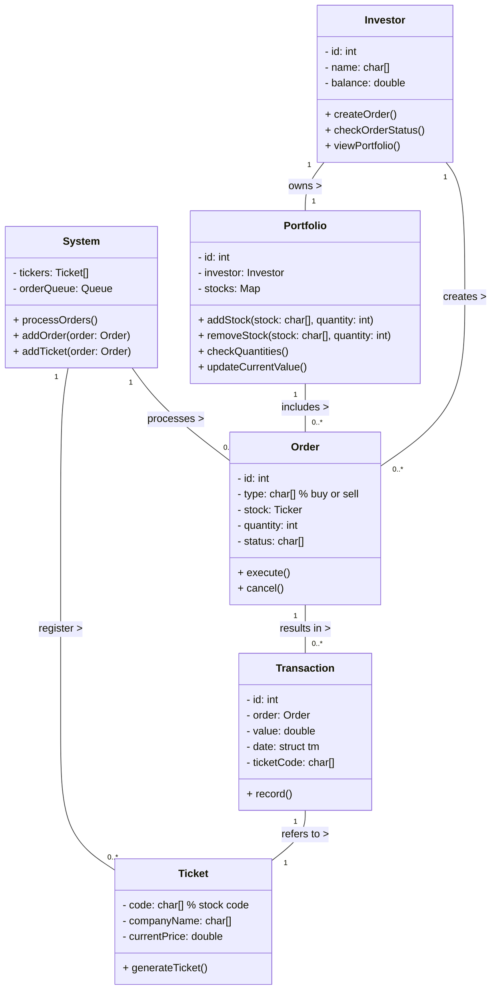

# Documentação

```mermaid
classDiagram
    class Investor {
        - id: int
        - name: char[]
        - balance: double
        + createOrder()
        + checkOrderStatus()
        + viewPortfolio()
    }

    class Order {
        - id: int
        - type: char[]     % buy or sell
        - stock: Ticker
        - quantity: int
        - status: char[]
        + execute()
        + cancel()
    }

    class Ticket {
        - code: char[]      % stock code
        - companyName: char[]
        - currentPrice: double
        + generateTicket()
    }

    class System {
	    - tickers: Ticket[]
        - orderQueue: Queue<Order>
        + processOrders()
        + addOrder(order: Order)
        + addTicket(order: Order)
    }

    class Transaction {
        - id: int
        - order: Order
        - value: double
        - date: struct tm
        - ticketCode: char[]
        + record()
    }

    class Portfolio {
        - id: int
        - investor: Investor
        - stocks: Map<char[], int>
        + addStock(stock: char[], quantity: int)
        + removeStock(stock: char[], quantity: int)
        + checkQuantities()
        + updateCurrentValue()
    }

    Investor "1" -- "0..*" Order : creates >
    Investor "1" -- "1" Portfolio : owns >
    System "1" -- "0..*" Order : processes >
    System "1" -- "0..*" Ticket : register >
    Order "1" -- "0..*" Transaction : results in >
    Transaction "1" -- "1" Ticket : refers to >
    Portfolio "1" -- "0..*" Order : includes >
```