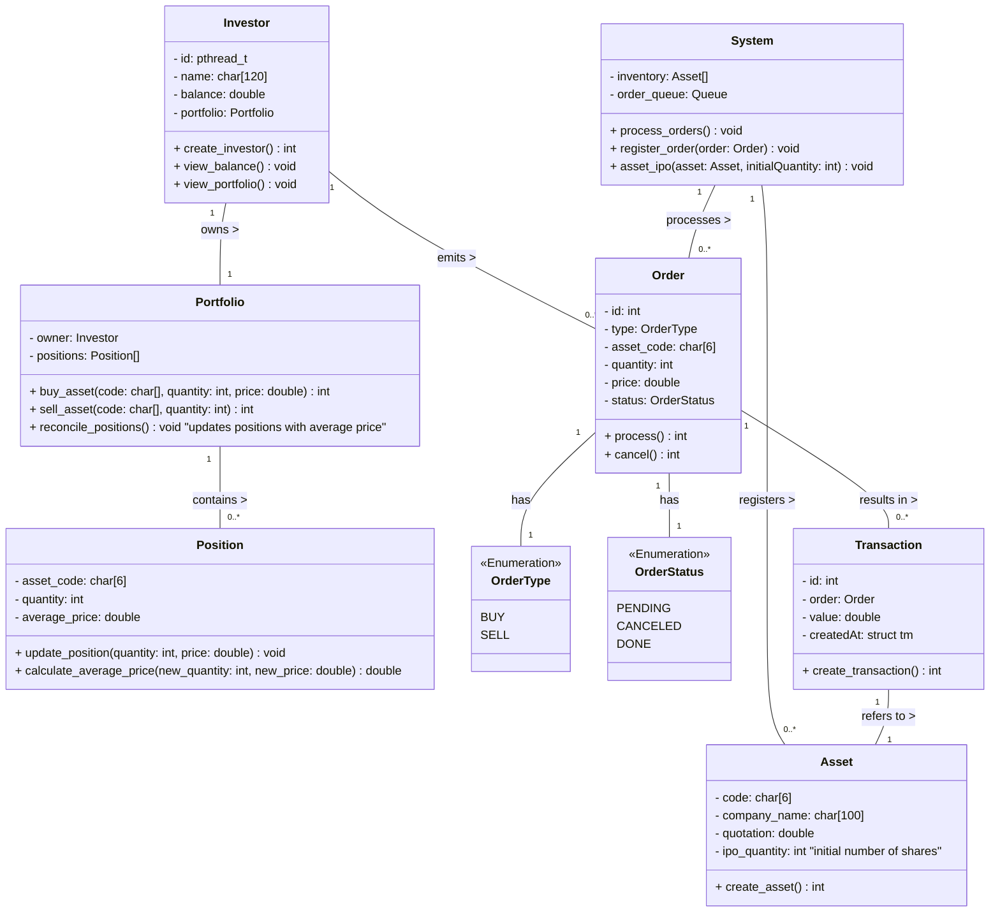

# Documentação



## Investidores

Os investidores realizam ações de compra e venda de ações de forma aleatória, com intervalos variáveis e revezamento em grupos, a aplicação pode seguir o conceito de escalonamento circular por quantum, semelhante ao Round Robin. Além disso, a lógica de multithreading será usada para simular a execução de cada investidor, e uma fila de execução será usada para gerenciar os grupos de investidores ativos.

Estrutura:

- Cada investidor será uma thread, que executa operações de compra e venda em intervalos aleatórios entre 2 a 5 segundos.
- O tempo de vida de cada investidor será aleatório, por exemplo, entre 20 e 30 segundos.
- Apenas grupos de 5 investidores estarão ativos simultaneamente.
- Um pool de 20 investidores será gerenciado para revezar grupos de threads após o tempo de vida de cada investidor expirar.

```

```
